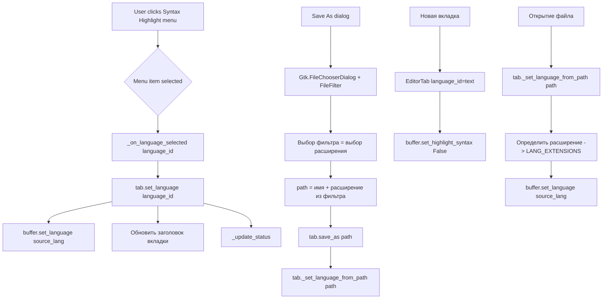

# План: Версия 1.1.0 — Меню выбора подсветки синтаксиса

## Обзор

Добавить в приложение меню **Syntax Highlight**, позволяющее пользователю вручную выбирать язык подсветки синтаксиса для текущего файла. Подсветка жёстко привязывается к расширению файла. В диалог сохранения добавляется выбор расширения файла. Поддерживаемые форматы: `txt`, `csv`, `md`, `xml`, `json`, `os` (1С Предприятие).

## Требования

1. **Меню "Syntax Highlight"** в строке меню со списком языков:
   - Plain Text (.txt)
   - CSV (.csv)
   - Markdown (.md)
   - XML (.xml)
   - JSON (.json)
   - 1C Enterprise (.os)
2. Выбор языка в меню **немедленно** меняет подсветку в текущем буфере.
3. Подсветка жёстко привязана к расширению файла — при смене языка через меню `EditorTab._language` меняется, и при сохранении через диалог расширение файла определяется выбранным языком.
4. В диалоге **Save As** добавить выпадающий список **File type** с фильтром расширений.
5. При создании новой вкладки (без пути) язык по умолчанию — **Plain Text (.txt)**.
6. Подсветка для `.os` (1С Предприятие) — кастомный `.lang` файл для GtkSourceView.

## Архитектура изменений

### 1. Кастомный .lang файл для 1С Предприятие

Создать XML-файл определения языка для GtkSourceView:

**Файл:** `languages/1c-ent.lang`

Содержимое — описание синтаксиса 1С со следующими ключевыми словами/конструкциями:
- Ключевые слова: `Если`, `Иначе`, `КонецЕсли`, `Процедура`, `КонецПроцедуры`, `Функция`, `КонецФункции`, `Пока`, `Цикл`, `КонецЦикла`, `Для`, `Каждого`, `Из`, `Перем`, `Экспорт`, `Возврат`, `Новый`, `Попытка`, `Исключение`, `КонецПопытки`, `И`, `Или`, `Не`, `Истина`, `Ложь`, `Неопределено`, `NULL`
- Комментарии: `//` и `/* ... */`
- Строки в двойных кавычках `"..."`
- Числа

Файл будет загружаться через `GtkSource.LanguageManager` (можно положить рядом с приложением и задать search path).

### 2. Расширение EditorTab

Добавить поле `self._language_id: str`, которое хранит ID текущего языка.

Изменить конструктор:
```python
def __init__(self, path=None, content='', encoding='utf-8', language_id='text'):
```

Метод `_set_language_from_path` модифицируется:
- При установке пути вызывает установку языка на основе нового `LANG_EXTENSIONS`
- Если язык не найден — `text` (Plain Text)

Новый метод `set_language(language_id: str)`:
- Устанавливает `self._language_id`
- Обновляет `self.buffer.set_language()` через `GtkSource.LanguageManager`
- Если `language_id == 'text'` или `'csv'` — отключает подсветку (или использует специальный минимальный lang)
- Обновляет заголовок вкладки

### 3. Обновление LANG_EXTENSIONS

```python
LANG_EXTENSIONS = {
    '.txt': 'text',
    '.csv': 'csv',
    '.md': 'markdown',
    '.xml': 'xml',      # 'xml' из GtkSource
    '.json': 'json',    # 'json' из GtkSource
    '.os': '1c-ent',    # кастомный
    # остальные существующие оставить
}
```

Для `text` и `csv` нет встроенных lang-файлов в GtkSourceView 3.0, поэтому:
- `text` — отключаем подсветку (`self.buffer.set_highlight_syntax(False)`)
- `csv` — создаём минимальный lang с подсветкой разделителей (`,`, `;`, `|`, `\t`), или без подсветки

### 4. Меню Syntax Highlight

В `_build_menu_bar()` добавить новый пункт меню:

```
Syntax Highlight >
  Plain Text (.txt)
  CSV (.csv)
  Markdown (.md)
  XML (.xml)
  JSON (.json)
  1C Enterprise (.os)
```

Использовать `Gtk.RadioMenuItem` с группировкой, чтобы текущий язык был помечен.

Обработчик `_on_language_selected(language_id)`:
1. Получает текущую вкладку
2. Вызывает `tab.set_language(language_id)`
3. Вызывает `self._refresh_tab_titles()`
4. Вызывает `self._update_status()`

### 5. Диалог Save As с выбором расширения

Модифицировать `_save_tab_as()`:
- Добавить `Gtk.FileFilter` для каждого поддерживаемого типа:
  - `Plain Text (*.txt)`
  - `CSV (*.csv)`
  - `Markdown (*.md)`
  - `XML (*.xml)`
  - `JSON (*.json)`
  - `1C Enterprise (*.os)`
- Выбранный фильтр определяет расширение сохраняемого файла
- В `Gtk.FileChooserDialog` также добавить `set_current_name` с именем и предполагаемым расширением на основе `_language_id` вкладки

### 6. Инициализация языка для новой вкладки

При создании новой вкладки (`_new_tab()`):
```python
tab = EditorTab(language_id='text')
```

### 7. Синхронизация меню с текущей вкладкой

В `_on_switch_page` обновлять активный пункт меню в соответствии с `tab._language_id`.

## Файлы для изменения

| Файл | Описание изменений |
|------|-------------------|
| `notepadpp_linux.py` | Основные изменения: EditorTab, меню, LANG_EXTENSIONS, диалог сохранения |
| `languages/1c-ent.lang` | Новый файл — кастомный lang для 1С |
| `languages/csv.lang` | Новый файл — кастомный lang для CSV |
| `packaging/notepadpp-linux_1.0.1/DEBIAN/control` | Обновить версию до 1.1.0 |
| `packaging/notepadpp-linux_1.0.1/usr/share/notepadpp-linux/notepadpp_linux.py` | Синхронизировать изменения |
| Создать `packaging/notepadpp-linux_1.1.0/` | Новый каталог для версии 1.1.0 |
| `README.md` | Обновить список функций |

## Последовательность выполнения

### Этап 1: Подготовительные работы
1. Обновить версию в `DEBIAN/control` для 1.0.1 → 1.1.0
2. Создать каталог `packaging/notepadpp-linux_1.1.0/` (копия 1.0.1 с новым кодом)
3. Создать структуру `languages/` в проекте

### Этап 2: Кастомные .lang файлы
4. Создать `languages/1c-ent.lang` — описание синтаксиса 1С Предприятие
5. Создать `languages/csv.lang` — описание синтаксиса CSV
6. Зарегистрировать пути к .lang файлам через `GtkSource.LanguageManager`

### Этап 3: Изменения в EditorTab
7. Добавить поле `_language_id` и параметр в `__init__`
8. Реализовать метод `set_language(language_id)`
9. Модифицировать `_set_language_from_path`
10. Обновить `LANG_EXTENSIONS` словарь

### Этап 4: Меню Syntax Highlight
11. Добавить секцию меню в `_build_menu_bar()`
12. Реализовать `_on_language_selected()`
13. Реализовать `_sync_language_menu_from_current_tab()`

### Этап 5: Диалог Save As
14. Модифицировать `_save_tab_as()` — добавить фильтры и авто-расширение

### Этап 6: Синхронизация и сборка
15. Синхронизировать все изменения в `packaging/notepadpp-linux_1.1.0/`
16. Собрать пакет
17. Обновить `README.md`

## Схема взаимодействия



## Примечания

- GtkSourceView 3.0 не имеет встроенной подсветки для `.txt`, `.csv` и `.os` — для них нужны кастомные `.lang` файлы
- `.txt` можно сделать через отключение подсветки, что проще
- `.csv` — минимальная подсветка (разделители и строки в кавычках)
- Для загрузки кастомных .lang файлов нужно установить `search_path` для `GtkSource.LanguageManager` на каталог `languages/`
- При установке deb-пакета .lang файлы должны копироваться в `/usr/share/gtksourceview-3.0/language-specs/` или в каталог рядом со скриптом
